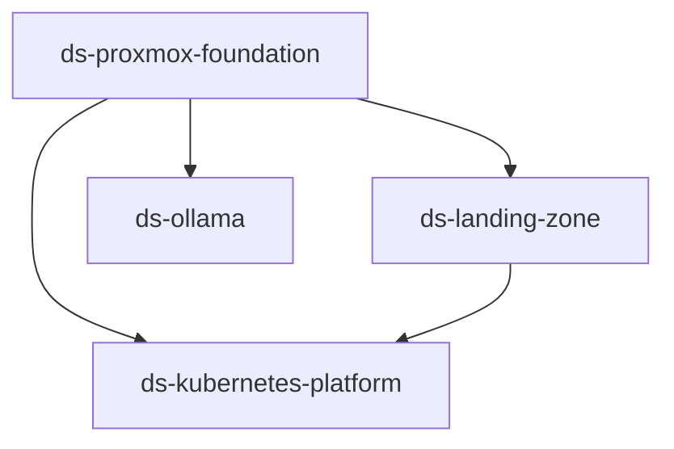

# Deployment Scopes

This directory contains the deployment scopes that define the platform's primary composition, lifecycle and management boundaries.

Each deployment scope has its own `README.md` describing its purpose, composition, dependencies and constraints. Machine-readable scope dependencies are stored in each scope's `metadata.yaml`.

## Contents

| Deployment scope | Purpose |
|---|---|
| [`ds-proxmox-foundation`](./ds-proxmox-foundation/README.md) | Provides the Proxmox host-level networking, firewall enforcement and bootstrap storage capabilities required by higher platform scopes. |
| [`ds-landing-zone`](./ds-landing-zone/README.md) | Provides controlled administrative access to protected platform networks through the bastion capability. |
| [`ds-kubernetes-platform`](./ds-kubernetes-platform/README.md) | Provides the Kubernetes control plane and independently scalable worker capacity. |
| [`ds-ollama`](./ds-ollama/README.md) | Provides an isolated Ollama test deployment with its own lifecycle. |

## Dependency overview

The arrows indicate that the downstream scope depends on a capability provided by the upstream scope.

## Dependency rules

- `ds-proxmox-foundation` is the platform foundation and does not depend on another deployment scope in this repository.
- `ds-landing-zone` depends on foundation networking, firewall enforcement and VM bootstrap prerequisites.
- `ds-kubernetes-platform` depends on the foundation and currently on landing-zone administrative access.
- `ds-ollama` depends on the foundation but remains independent from Kubernetes.
- Consumer scopes own their connectivity and firewall requirements. `ds-proxmox-foundation` owns enforcement of those requirements.
- Central infrastructure monitoring is treated as an external shared capability and may be consumed by each scope where required.

## Reading order

For a quick architecture overview, start with this file and then read the scope README that is relevant to the change being planned. Use the scope's `metadata.yaml` when dependency information is needed for automation or CI/CD orchestration.
