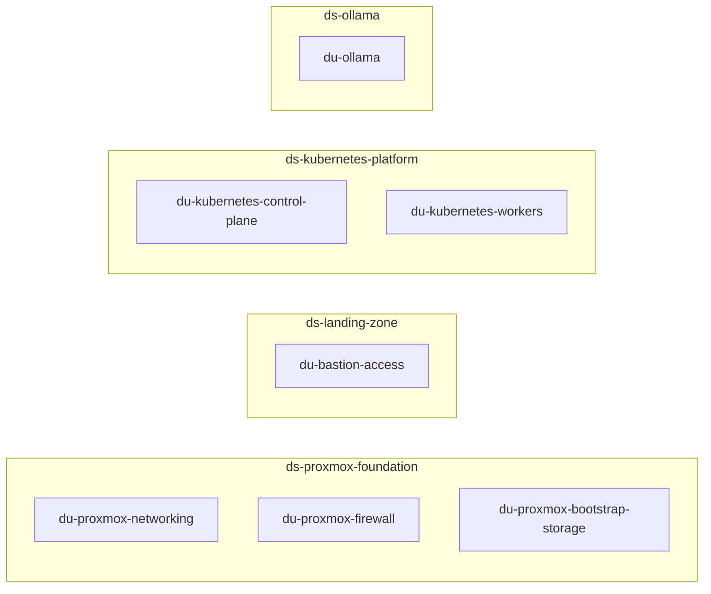

# Deployment Units

This directory contains the deployment units that define coherent infrastructure or platform capabilities with their own responsibility and lifecycle characteristics.

Deployment units are composed into deployment scopes. Their README files describe boundaries, interfaces, dependencies and ownership.

## Contents

| Deployment unit | Deployment scope | Primary responsibility |
|---|---|---|
| [`du-proxmox-networking`](./du-proxmox-networking/README.md) | `ds-proxmox-foundation` | Proxmox host networking, VLAN interfaces, gateways and routing. |
| [`du-proxmox-firewall`](./du-proxmox-firewall/README.md) | `ds-proxmox-foundation` | Host firewall, NAT and enforcement of consumer-provided connectivity requirements. |
| [`du-proxmox-bootstrap-storage`](./du-proxmox-bootstrap-storage/README.md) | `ds-proxmox-foundation` | Minimal Proxmox snippet/bootstrap storage capability. |
| [`du-bastion-access`](./du-bastion-access/README.md) | `ds-landing-zone` | Controlled administrative access to protected platform networks. |
| [`du-kubernetes-control-plane`](./du-kubernetes-control-plane/README.md) | `ds-kubernetes-platform` | Kubernetes control-plane compute, cluster initialization and core cluster configuration. |
| [`du-kubernetes-workers`](./du-kubernetes-workers/README.md) | `ds-kubernetes-platform` | Independently scalable Kubernetes worker capacity and worker registration. |
| [`du-ollama`](./du-ollama/README.md) | `ds-ollama` | Isolated Ollama test VM and service deployment. |

## Composition overview

## Important relationships

- `du-proxmox-networking` provides the network foundation used by higher platform capabilities.
- `du-proxmox-firewall` owns firewall enforcement, while connectivity requirements remain owned by the consumer scope that needs them.
- `du-bastion-access` provides controlled management access but does not own the platforms being accessed.
- `du-kubernetes-control-plane` creates and initializes the Kubernetes cluster.
- `du-kubernetes-workers` can scale or be replaced independently from the control plane and join the cluster provided by the control-plane unit.
- `du-ollama` remains intentionally independent from Kubernetes and other test workloads.

## How to use this index

Use this file to find the unit responsible for a capability. For deployment ordering and dependencies between complete platform capabilities, use the [`deployment-scopes` overview](../deployment-scopes/README.md). For detailed interfaces and implementation constraints, follow the README of the relevant deployment unit.
