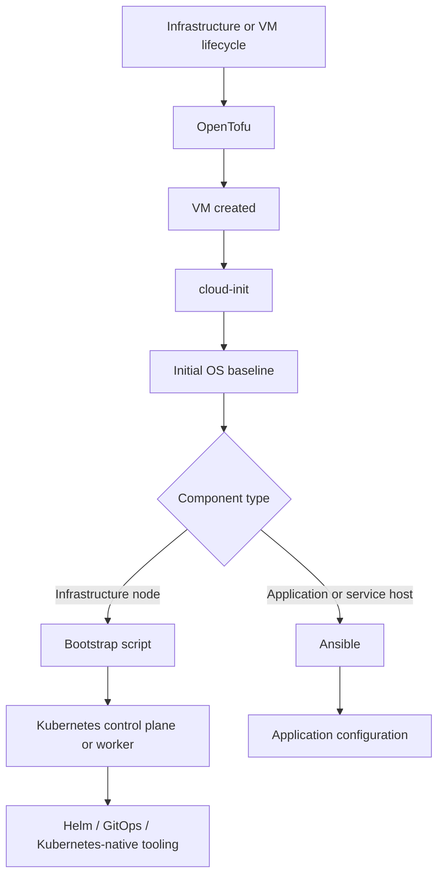
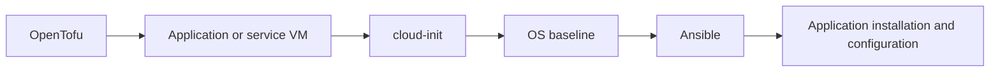

# ADR-008: Tool responsibilities for infrastructure and configuration management

- Status: Proposed
- Date: 2026-09-08
- Owners: To be defined

## Context

The platform uses multiple deployment and configuration tools. Without an explicit responsibility boundary, tools can overlap and create unnecessary coupling between infrastructure provisioning, operating-system bootstrap, Kubernetes bootstrap and application configuration.

The existing bootstrap currently combines OpenTofu-based VM provisioning with a handover to Ansible for later configuration. The target architecture requires these responsibilities to be separated according to the lifecycle and ownership of the managed component.

The guiding principle is:

> Tool choice follows the lifecycle and ownership boundary of the managed component, not personal preference or historical implementation.

## Decision

The following tool responsibilities are adopted.

### OpenTofu

OpenTofu is used for declarative infrastructure provisioning and lifecycle management, including:

- Proxmox virtual machines;
- infrastructure-level networking resources where managed declaratively;
- storage and bootstrap prerequisites;
- other infrastructure resources with a clear lifecycle and state boundary.

OpenTofu does not manage application configuration inside long-lived service hosts.

### cloud-init

cloud-init is used for the initial operating-system baseline during VM creation, including:

- users and SSH keys;
- required base packages;
- time synchronisation;
- minimal security baseline;
- prerequisites required by the role of the VM.

Infrastructure nodes must leave provisioning with the required OS baseline already applied.

### Bootstrap scripts

Small bootstrap scripts are used for limited, one-time platform initialisation that logically belongs to the node itself, including:

- Kubernetes distribution installation;
- control-plane initialisation;
- control-plane join;
- worker join.

These scripts must remain small and purpose-specific. They are not a general configuration-management replacement.

### Ansible

Ansible is used for post-provisioning configuration management of longer-lived application or service hosts where configuration can evolve independently of the infrastructure lifecycle, including:

- Ollama and similar application/service hosts;
- non-infrastructure virtual machines containing application or business logic;
- containers running outside Kubernetes when configuration management is required;
- host-level application configuration that is expected to change during the lifetime of the machine.

Ansible is not a mandatory dependency of the Kubernetes platform bootstrap.

### Kubernetes-native tooling

Helm, GitOps tooling and other Kubernetes-native mechanisms are used for workloads and platform components that run inside Kubernetes.

Ansible must not be used to manage normal Kubernetes workload lifecycle where Kubernetes-native declarative mechanisms are available.

## Delivery flow

### Kubernetes flow

### Application/service host flow

Ollama currently follows this application/service host pattern.

## Alternatives considered

### Use Ansible for all guest configuration

This would provide one general-purpose configuration mechanism for infrastructure nodes and application hosts.

It was not selected because it creates an unnecessary hard dependency on an external configuration-management execution environment for infrastructure nodes that should be reproducible directly from their provisioning definition.

### Put all configuration in cloud-init

This would remove Ansible and most bootstrap tooling.

It was not selected because cloud-init is intended for initial instance bootstrap and becomes difficult to maintain when used for complex or evolving application configuration.

### Use only shell scripts after provisioning

This would minimise the number of tools.

It was not selected because larger, long-lived application configuration benefits from idempotency, structure and configuration-management capabilities provided by Ansible.

## Consequences

### Positive

- Infrastructure nodes have fewer external bootstrap dependencies.
- Kubernetes bootstrap remains independent of Ansible.
- VM provisioning and application configuration have clear lifecycle boundaries.
- Application hosts can still use Ansible where repeated configuration changes justify it.
- Kubernetes workloads use platform-native declarative mechanisms.
- Tool responsibilities are explicit and easier to automate independently.

### Negative

- The platform intentionally uses several specialised tools instead of one universal tool.
- cloud-init and bootstrap scripts require clear scope control to avoid becoming large configuration frameworks.
- Teams must understand which lifecycle boundary a change belongs to before choosing the implementation mechanism.

## Risks

- Bootstrap scripts may gradually grow into an unmanaged configuration-management layer.
- Configuration may be duplicated between cloud-init and Ansible if ownership is not kept explicit.
- Application teams may incorrectly use Ansible for Kubernetes workloads that should be managed declaratively through Kubernetes-native tooling.

## Follow-up actions

- [ ] Define the minimal OS security baseline applied through cloud-init.
- [ ] Define the bootstrap contract for Kubernetes control-plane and worker nodes.
- [ ] Validate whether RKE2 or K3s is the preferred Kubernetes distribution.
- [ ] During implementation, verify that application/service hosts such as Ollama use Ansible only for post-provisioning configuration.
