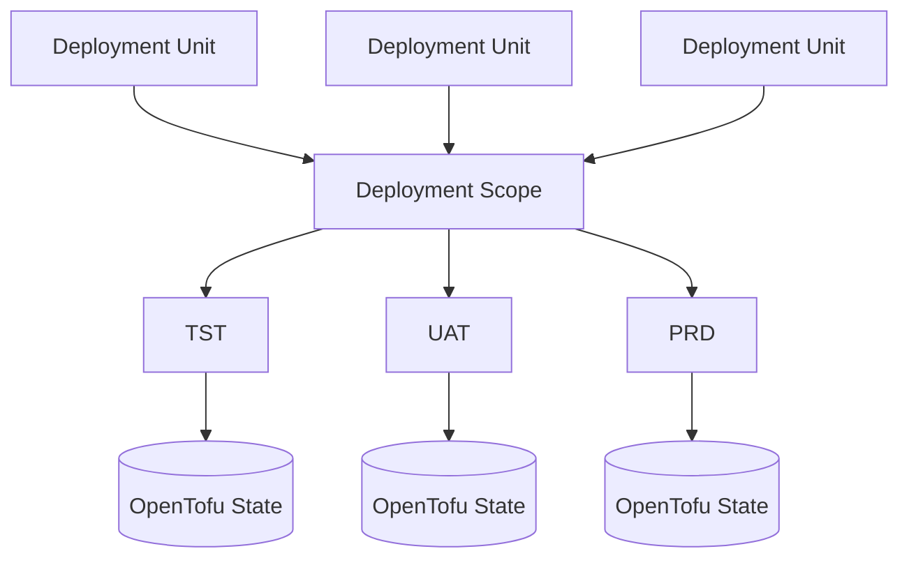
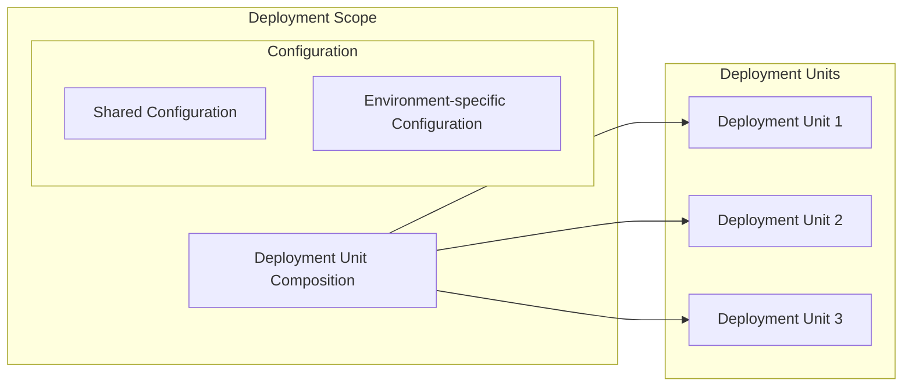

# Deployment Scope Model

## Purpose

This document visualises the relationship between deployment units, deployment scopes, environments and OpenTofu state.

It complements the architectural decisions that define deployment units and deployment scopes.

## Deployment scope and environment model

A deployment scope composes one or more deployment units into a coherent functional or platform capability.

The same deployment scope definition can be used across multiple environments.

Environment-specific configuration contains only the differences from the shared scope definition.

OpenTofu state is separated per combination of deployment scope and environment.

## Deployment scope composition

Deployment units are defined independently from deployment scopes and can therefore be reused by different scopes where appropriate.

A deployment scope references and composes the deployment units required to realise its responsibility.

The deployment scope may additionally contain:

* shared configuration that belongs to the scope as a whole;
* environment-specific configuration containing only the differences required for a particular environment;
* limited scope-specific configuration or infrastructure required to connect or integrate its deployment units, provided that this does not justify a separate deployment unit.

If a scope-specific element develops its own responsibility, lifecycle, reuse potential or independent management requirements, it should be evaluated as a separate deployment unit.

## Related decisions

* [ADR-001 — Define Deployment Units as Architecture Boundaries](../decisions/ADR-001-deployment-units.md)
* [ADR-002 — Define Deployment Scopes as Composition Boundaries](../decisions/ADR-002-deployment-scopes.md)
